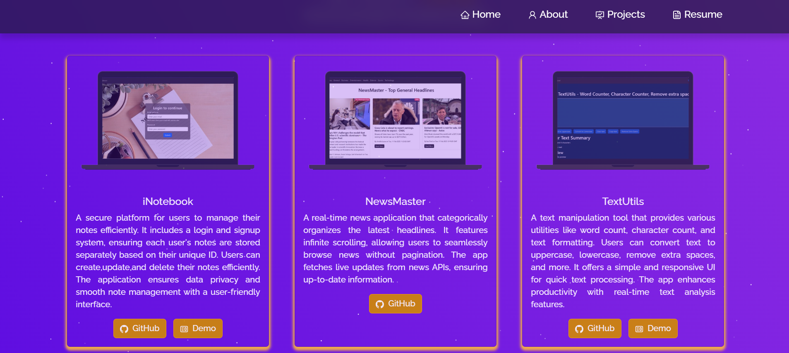

# 🚀 Personal Portfolio

## 🌟 Overview
This is a **React-based personal portfolio** showcasing my **skills, tools, projects, and resume**.
It features **smooth animations**, an elegant UI, and a fully responsive design.

## 🎥 Demo Video  
Click the image below to watch the demo:  

[](https://drive.google.com/file/d/YOUR_VIDEO_FILE_ID/preview)  

## 📸 Screenshots




## 🎨 Features
- 🔹 **Modern UI/UX** – Aesthetic and interactive interface  
- 🔹 **Animations & Transitions** – Smooth GSAP/Framer Motion animations  
- 🔹 **Skills & Tools** – Displays tech stack & proficiencies  
- 🔹 **Projects Showcase** – Highlights my work with details  
- 🔹 **Resume Section** – Includes my downloadable resume  
- 🔹 **Contact Form** – Lets users reach out easily  
- 🔹 **Fully Responsive** – Works on all screen sizes  

## 🛠 Tech Stack
- **Frontend:** React.js, JavaScript, HTML, CSS  
- **Styling:** Bootstrap / Styled Components  
- **Deployment:** Vercel / Render / GitHub Pages  


## 🚀 Getting Started  

### 📌 Prerequisites  
Ensure you have **Node.js** and **npm** installed.  

### 🔧 Installation Steps  
1. **Clone the Repository**  
   ```sh
   git clone https://github.com/RohitParmar-17/Portfolio.git
   cd Portfolio
   ```
2. **Install Dependencies**  
   ```sh
   npm install
   ```
3. **Start the Development Server**  
   ```sh
   npm start
   ```
   The app will be available at **`http://localhost:3000/`**  

## 📤 Deployment  
### 🔹 Deploying on **Vercel**  
```sh
vercel deploy
```
### 🔹 Deploying on **Netlify**  
```sh
netlify deploy
```
### 🔹 Deploying on **GitHub Pages**  
1. In `package.json`, add:  
   ```json
   "homepage": "https://RohitParmar-17.github.io/Portfolio"
   ```
2. Run:  
   ```sh
   npm run build
   npm run deploy
   ```

## 🤝 Contributing  
1. Fork the repository  
2. Create a new branch (`git checkout -b feature-branch`)  
3. Make changes & commit (`git commit -m "Added new feature"`)  
4. Push to branch (`git push origin feature-branch`)  
5. Open a pull request  


## 💌 Contact  
For any queries or suggestions, feel free to reach out:  
- **Email:** rohitghost5050@gmail.com  
---

